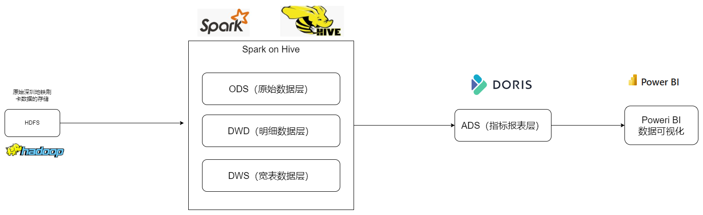
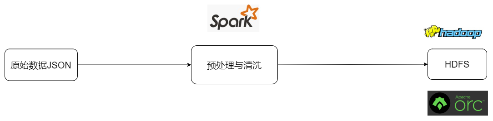

# 项目简介

本项目主要面对的数据是深圳地铁刷卡数据，通过Spark + Hive等大数据技术分析海量的深圳地铁刷卡数据，来探究深圳地铁客运能力，探索深圳地铁运营服务、客流情况，为深圳地铁优化运营服务提供支撑；

本项目构建了一个智慧、高效、多维的数据仓库，将深圳地铁刷卡数据，为深圳地铁数据分析、数据运营决策提供有效数据的支撑；

# 深圳地铁客流分析架构

## 技术架构：

Hadoop HDFS：存储海量深圳地铁刷卡数据；

Spark on Hive：Hive MetaStore存储以及提高元数据服务，Spark利用海量数据处理、计算的能力；

Doris：OLAP引擎，进行快速、高效的统计指标计算；

Poweri BI：提高数据可视化报表服务；

## 数据仓库架构：

数据仓库：使用HDFS + Hive + Spark + Doris + Power BI构建整体的数据仓库，如下图所示：




# 原始结构

```json
{
    "total": 1337000,
    "data": [
        {
            "deal_date": "2018-08-31 22:14:50",
            "close_date": "2018-09-01 00:00:00",
            "card_no": "CBEHFCFCG",
            "deal_value": "0",
            "deal_type": "地铁入站",
            "company_name": "地铁五号线",
            "car_no": "IGT-105",
            "station": "布吉",
            "conn_mark": "0",
            "deal_money": "0",
            "equ_no": "263032105"
        },
        {
            "deal_date": "2018-08-31 22:13:39",
            "close_date": "2018-09-01 00:00:00",
            "card_no": "CBCEBDIJE",
            "deal_value": "0",
            "deal_type": "地铁入站",
            "company_name": "地铁五号线",
            "car_no": "IGT-105",
            "station": "布吉",
            "conn_mark": "0",
            "deal_money": "0",
            "equ_no": "263032105"
        },
        .....
     ]
    "page": 1,
    "rows": 1000
}
```

data说明：

|     字段     |                说明                |
| :----------: | :--------------------------------: |
|  deal_date   |              刷卡日期              |
|  close_date  |              关闭时间              |
|   card_no    |                卡号                |
|  deal_value  |              交易价值              |
|  deal_type   | 出入站类型："地铁入站"、"地铁出站" |
| company_name |             地铁线名称             |
|    car_no    |             地铁列车号             |
|   statiion   |               地铁站               |
|  conn_mark   |              连续标记              |
|  deal_money  |              实收金额              |
|    equ_no    |              闸机编号              |

# 指标需求

```txt
【体现进站压力】 每站进站人次排行榜      
	ads_in_station_day_top
【体现出站压力】 每站出站人次排行榜      
	ads_out_station_day_top
【体现进出站压力】 每站进出站人次排行榜      
	ads_in_out_station_day_top
【体现通勤车费最多】 每卡日消费排行      
	ads_card_deal_day_top  
【体现线路运输贡献度】 每线路单日运输乘客总次数排行榜，进站算一次，出站并且联程算一次     
	ads_line_send_passengers_day_top  
【体现利用率最高的车站区间】 每日运输乘客最多的车站区间排行榜       
	ads_stations_send_passengers_day_top
【体现线路的平均通勤时间，运输效率】 每条线路单程直达乘客耗时平均值排行榜     
	ads_line_single_ride_average_time_day_top
【体现深圳地铁全市乘客平均通勤时间】 所有乘客从上车到下车间隔时间平均值    
	ads_all_passengers_single_ride_spend_time_average
【体现通勤时间最长的乘客】 单日从上车到下车间隔时间排行榜     
	ads_passenger_spend_time_day_top
【体现车站配置】 每个站点进出站闸机数量排行榜
	每个站点入站闸机数量  		ads_station_in_equ_num_top
	每个站点出站闸机数量    		ads_station_out_equ_num_top
【体现各线路综合服务水平】 各线路进出站闸机数排行榜
	各线路进站闸机数排行榜 		ads_line_in_equ_num_top
	各线路出站闸机数排行榜 		ads_line_out_equ_num_top
【体现收入最多的车站】 出站交易收入排行榜   
	ads_station_deal_day_top
【体现收入最多的线路】 出站交易所在线路收入排行榜   
	ads_line_deal_day_top
【体现换乘比例、乘车体验】 每天每线路换乘出站乘客百分比排行榜  
	ads_conn_ratio_day_top
【体现每条线的深圳通乘车卡普及程度 9.5 折优惠】 出站交易优惠人数百分比排行榜     
	ads_line_sale_ratio_top
【体现换乘的心酸】 换乘耗时最久的乘客排行榜	
	ads_conn_spend_time_top
【体现线路拥挤程度】 上车以后还没下车，每分钟、小时每条线在线人数   
	ads_on_line_min_top
```

# 数据调研

## 业务调研

深圳地铁刷卡业务流程分析：

- 入站刷卡业务过程

  ```tex
  入站一次，记录一次入站刷卡信息
  ```

- 出站刷卡业务过程

  ```txt
  出站一次，记录一次出站刷卡信息
  ```

## 统计需求分析

根据统计需分析得出：

所需业务过程：

- 入站
- 出站

所需维度：

- 地铁站
- 卡号
- 线路
- 地铁站区间
- 时间

所需度量：

- 人次（人数）
- 金额
- 耗时
- 闸机数

# 数据仓库分层设计

数据仓库分层设计：

- ODS：原始数据层
- DWD：明细数据层
- DWS：汇总数据层
- ADS：数据应用层

# 数据预处理与清洗

> 程序对应目录为：/SzmPfBgAnalysis/etl_pyspark

原始数据为：

```json
{
    "total": 1337000,
    "data": [
        {
            "deal_date": "2018-08-31 22:14:50",
            "close_date": "2018-09-01 00:00:00",
            "card_no": "CBEHFCFCG",
            "deal_value": "0",
            "deal_type": "地铁入站",
            "company_name": "地铁五号线",
            "car_no": "IGT-105",
            "station": "布吉",
            "conn_mark": "0",
            "deal_money": "0",
            "equ_no": "263032105"
        },
        {
            "deal_date": "2018-08-31 22:13:39",
            "close_date": "2018-09-01 00:00:00",
            "card_no": "CBCEBDIJE",
            "deal_value": "0",
            "deal_type": "地铁入站",
            "company_name": "地铁五号线",
            "car_no": "IGT-105",
            "station": "布吉",
            "conn_mark": "0",
            "deal_money": "0",
            "equ_no": "263032105"
        },
        .....
     ]
    "page": 1,
    "rows": 1000
}
```

抛弃total字段，page字段、rowss字段、去除data数据中只有9个字段的数据，让每一行只存储存储如下形式的数据：

```txt
        "deal_date": "2018-08-31 22:14:50",
        "close_date": "2018-09-01 00:00:00",
        "card_no": "CBEHFCFCG",
        "deal_value": "0",
        "deal_type": "地铁入站",
        "company_name": "地铁五号线",
        "car_no": "IGT-105",
        "station": "布吉",
        "conn_mark": "0",
        "deal_money": "0",
        "equ_no": "263032105"
```

使用PySpark进行深圳地铁数据预处理与清洗，将处理好的数据，以orc格式存储在HDFS中，架构如下：




# ODS层设计

ODS层主要储存来原始的深圳地铁刷卡数据，保持原始数据或者经过预处理与清洗后的原始数据

> SQL脚本在：/SzmPfBgAnalysis/szm_sql

ods_smz_data(深圳地铁刷卡原始数据)：

|     字段     |                说明                |  类型  |
| :----------: | :--------------------------------: | :----: |
|  deal_date   |              刷卡日期              | string |
|  close_date  |              关闭时间              | string |
|   card_no    |                卡号                | string |
|  deal_value  |              交易价值              | string |
|  deal_type   | 出入站类型："地铁入站"、"地铁出站" | string |
| company_name |             地铁线名称             | string |
|    car_no    |             地铁列车号             | string |
|   statiion   |               地铁站               | string |
|  conn_mark   |              连续标记              | string |
|  deal_money  |              实收金额              | string |
|    equ_no    |              闸机编号              | string |

# 多维数据模型设计

多维

步骤：

- 选择业务过程
- 声明粒度
- 确认维度
- 确定事实

入站事实表：

- 业务过程：入站事实
- 粒度：一条入站记录
- 维度：刷卡日期、卡号、地铁线名称、地铁列车号、地铁站
- 事实：闸机编号

出站事实表：

- 业务过程：出站事实
- 粒度：一条出站记录
- 维度：刷卡日期、关闭时间、卡号、地铁线名称、地铁列车号、地铁站、连续标记
- 事实：交易价值、实收金额、闸机编号

地铁进出站总表

- 业务过程：进出站事实（不包含巴士）
- 粒度：一条出站记录
- 维度：刷卡日期、关闭时间、卡号、地铁线名称、地铁列车号、地铁站、连续标记
- 事实：交易价值、实收金额、闸机编号

事实表概览：

- dwd_fact_szt_in_out_detail  地铁进出站总表
- dwd_fact_szt_in_detail      进站事实表
- dwd_fact_szt_out_detail     出站事实表

# Pyspark on hive

## 拷贝相关文件

将下列相关文件拷贝到./spark/conf目录下

- hadoop的core-site.xml、hdfs-site.xml
- hive的hive-site.xml

将mysql驱动拷贝到./spark/jars目录下

- mysql-connector-java-8.0.11.jar

Pyspark初始化代码

```python
from pyspark.sql import SparkSession

if __name__ == '__main__':
    spark = SparkSession.builder \
        .master("local[2]") \
        .config("hive.metastore.uris", "thrift://172.20.10.3:9083") \
        .appName("dwd") \
        .enableHiveSupport() \
        .getOrCreate()

    print(spark.sql("show databases").show())
```

